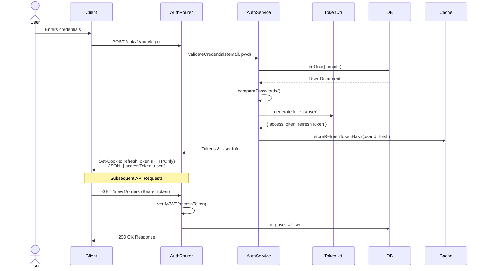

# Authentication & Authorization Flow

EventDecor implements a robust JWT-based authentication system with Access Tokens (short-lived) and Refresh Tokens (long-lived, HTTP-only cookies).

## Security Mechanisms

- **XSS Protection**: The `accessToken` is stored in memory on the frontend (React Context) and never in `localStorage`, mitigating XSS risks.
- **CSRF Protection**: The `refreshToken` is stored in an `HttpOnly`, `Secure`, `SameSite=Strict` cookie to prevent interception and CSRF attacks.
- **Token Revocation / Reuse Detection**: If a refresh token is used after it has been revoked or rotated, the system triggers a **Security Alert** and invalidates ALL active sessions for that user by clearing the Redis token hashes.
- **Rate Limiting & Lockout**: Login attempts are rate-limited via Redis. Consecutive failures trigger an account lockout.
