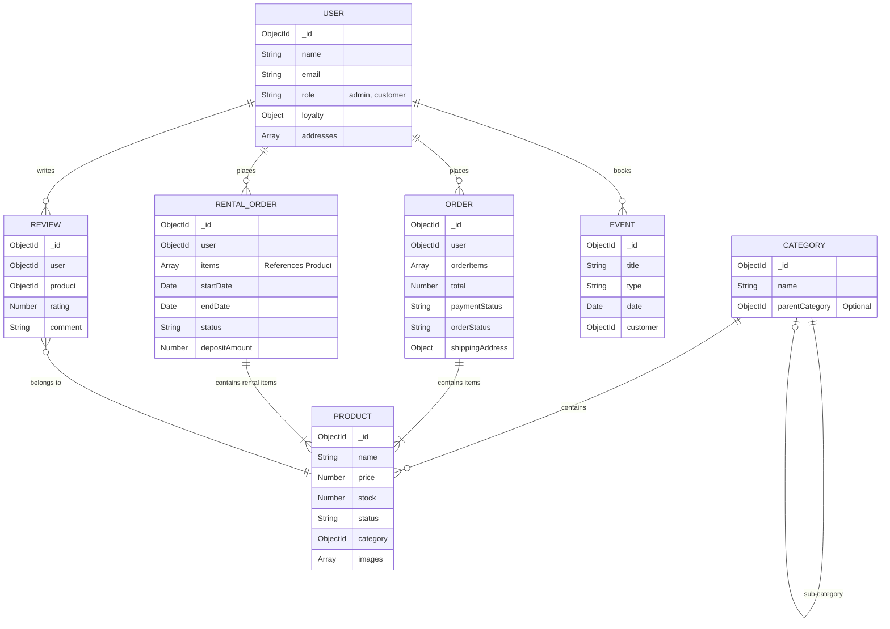

# Database Entity Relationship Diagram

This document illustrates the core entity relationships within the EventDecor MongoDB database. Due to MongoDB's document-oriented nature, some relationships are nested sub-documents (arrays) while others are hard references (`ObjectId`).

## Key Architectural Notes

- **Referential Integrity**: MongoDB does not enforce foreign keys. We handle integrity via Mongoose middlewares and application-level checks.
- **Embedded vs Referenced**:
  - `Addresses` and `Loyalty` are embedded inside the `USER` document because they are bounded to the user context and rarely exceed document size limits.
  - `Reviews` are referenced (`ObjectId`) rather than embedded inside `PRODUCT` to prevent unbounded document growth (a product might get 10,000 reviews).
