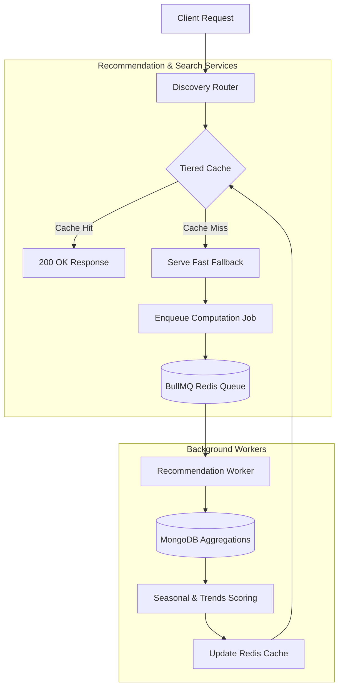

# Discovery & Recommendation Pipeline

The discovery engine unifies search, visual search, and personalized recommendations. It employs a tiered caching strategy to handle high traffic loads and uses background queues to precompute complex ML/analytical models.

## System Mechanics

- **Fast Fallbacks**: To prevent slow response times on cold starts, cache misses immediately return a generic fast fallback response (e.g., top-selling items) while asynchronously enqueuing a pre-computation job.
- **Tiered Cache**:
  - L1 (Memory): Short TTL for lightning-fast reads (bypasses network).
  - L2 (Redis): Centralized distributed cache for all instances.
- **Scoring**: Recommendations are weighted heavily by seasonal context (e.g., boosting Diwali items in November) and current trending events.
