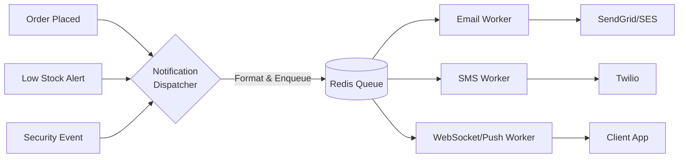

# Notification & Event Pipeline

The notification system uses a centralized service to aggregate, queue, and dispatch multi-channel alerts (Email, SMS, Push, In-App).

## Features

- **Decoupling**: Business logic (e.g., checkout) does not block waiting for emails to send. It simply dispatches a payload to the queue.
- **Retries**: BullMQ handles robust backoff and retry mechanisms for failing email/SMS APIs.
- **Admin Alerts**: System events (like low stock or security locks) are routed specifically to Admin dashboard push notifications.
