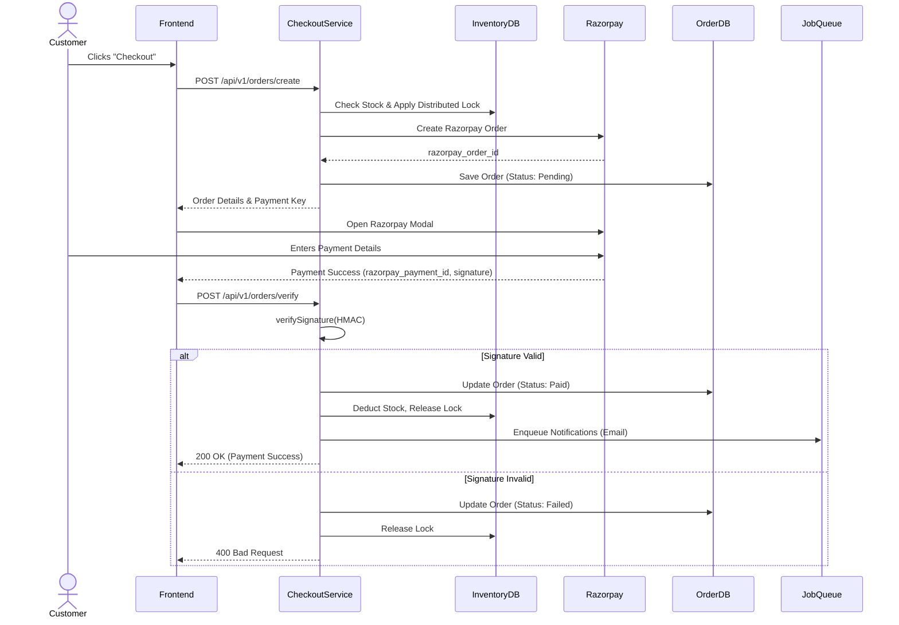

# Payment & Checkout Flow

This diagram illustrates the e-commerce checkout pipeline, including integration with Razorpay, payment reconciliation, and asynchronous post-order processing.

## Resilience & Reconciliation

- **Distributed Locks**: During the checkout phase, Redis locks are applied to inventory items to prevent overselling. If the payment modal is closed or times out, a background worker releases the lock.
- **Webhooks**: Razorpay sends asynchronous webhooks (`payment.captured`, `payment.failed`) which the backend uses to reconcile orders in case the client disconnects before sending the verification request.
