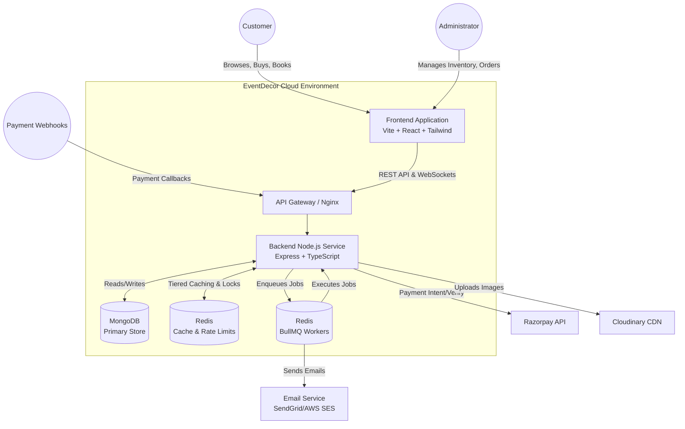

# System Context Architecture

This diagram illustrates the high-level architecture of the EventDecor platform, showing how external actors interact with the system and how internal components communicate.

## Core Components

- **Frontend**: A React SPA that consumes the REST API. Contains a customer storefront and an Admin Dashboard.
- **Backend Node.js**: The core monolith that orchestrates business logic (Authentication, Commerce, Recommendations).
- **MongoDB**: The primary persistence layer.
- **Redis**: Used heavily for tiered caching, distributed locking (to prevent double bookings), rate limiting, and BullMQ task queues.
- **Razorpay**: Handles all payment processing and verification.
- **Cloudinary**: Handles all media transformations (WebP/AVIF auto-negotiation) and image hosting.
